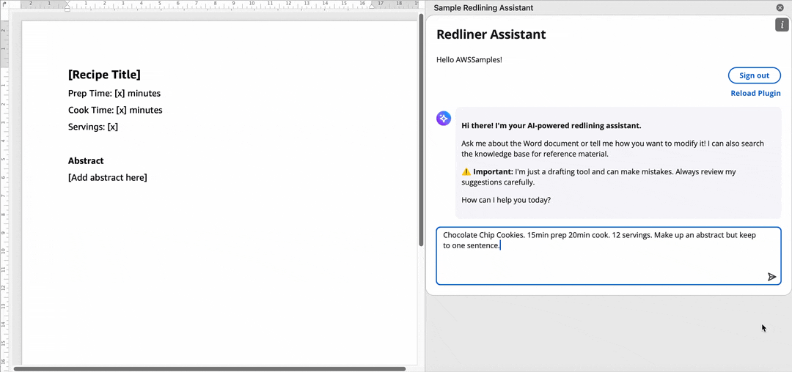
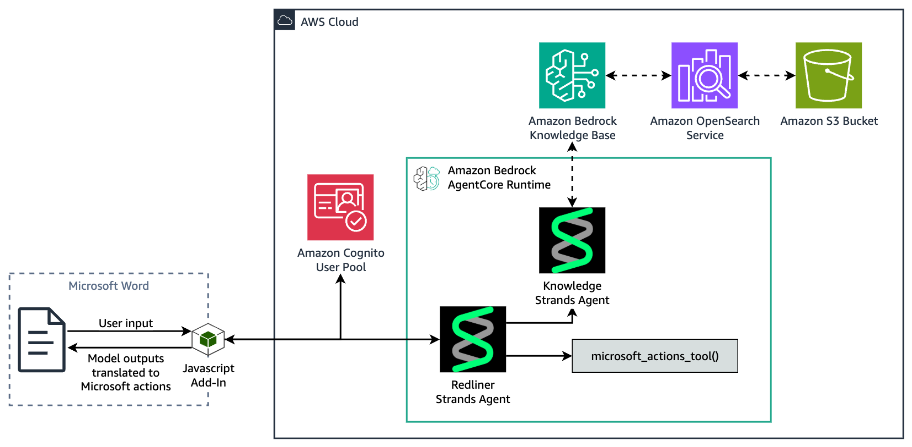

# AI-Powered Redlining Assistant in Microsoft Word using Strands Agents and Amazon Bedrock AgentCore

This repository demonstrates a redlining assistant powered by the Strands Agents SDK and hosted on Amazon Bedrock AgentCore Runtime. The assistant is exposed to the user as a Microsoft Word Add-In.

## ⚠️ Important Disclaimer

**This redlining tool is intended for demonstration purposes only and does not provide legal, financial, medical or any other professional advice, opinions or recommendations.** This application is not a substitute for professional advice or services. 

## Security Considerations

Although published publicly in `aws-samples`, this code serves as a reference implementation, not as an actively maintained open-source project. Before deploying, consider:

- **Test with non-sensitive data only** - Avoid using confidential or privileged documents during development and testing
- **Review security controls** - Evaluate whether additional controls are needed for your organization
- **Implement guardrails** - Add input and output validation and filtering as necessary to meet your organizational security standards and protect against malicious attacks such as prompt injection. You may consider using [Amazon Bedrock Guardrails](https://docs.aws.amazon.com/bedrock/latest/userguide/guardrails.html) for this
- **Apply principle of least privilege** - Review and restrict IAM permissions as necessary to meet your organizational security standards
- **Maintain dependencies** - Regularly update packages to address security vulnerabilities
- **Conduct thorough testing** - Perform regular security reviews, threat modeling, and user acceptance testing appropriate for your risk tolerance
- **Office CDN** - For security considerations relating to the Office CDN, refer to [guidance from Microsoft](https://github.com/OfficeDev/office-js)

## Requirements

- Node.js 16+
- TypeScript 4.5+
- Python 3.13+
- [uv](https://docs.astral.sh/uv/getting-started/installation/) (Python package manager)
- AWS CLI configured
- AWS CDK CLI (`npm install -g aws-cdk`)

## Supported AWS Regions

Deploy in any AWS region that supports the following services:

- Amazon Bedrock AgentCore Runtime
- Amazon Bedrock Knowledge Bases
- Amazon OpenSearch Serverless
- Amazon Cognito User Pools

## Quick Start

### 1. Install frontend packages

```bash
npm install
```

### 2. Deploy AWS backend

```bash
cd infrastructure
uv sync
uv run cdk bootstrap
uv run cdk deploy KnowledgeBaseStack
```

Note the deployment bucket name from the output (e.g., `knowledgebasestack-agentdeploymentbucket...`).

### 3. Package and upload agent code

```bash
cd ../agent
uv pip install \
  --python-platform aarch64-manylinux2014 \
  --python-version 3.13 \
  --target=deployment_package \
  --only-binary=:all: \
  -r pyproject.toml

cd deployment_package
zip -r ../deployment_package.zip .

cd ..
zip deployment_package.zip *.py

aws s3 cp deployment_package.zip s3://YOUR_DEPLOYMENT_BUCKET_NAME/
```

Replace `YOUR_DEPLOYMENT_BUCKET_NAME` with the bucket name from step 2.

### 4. Deploy remaining stacks

By default, the stack uses Claude Sonnet 4. To deploy with the default model:

```bash
cd ../infrastructure
uv run cdk deploy --all
```

To use a different model, specify it with the `-c model_id` context variable:

```bash
uv run cdk deploy --all -c model_id=MODEL_ID
```

### 5. Configure the application

Navigate to the root of your project directory. Make a copy of [`src/config.example.js`](src/config.example.js), rename it `src/config.js` and edit the file with your CDK outputs

```bash
# Copy and configure AWS settings
cp src/config.example.js src/config.js
# Edit src/config.js with CDK outputs
```

### 6. Start the application

```bash
npm start
```
This will start up Microsoft Word with the Add-In loaded. Follow the instructions in the Add-In to create an account. You will be able to use the Add-In once you create the account.

To subsequently close the application, run:
```bash
npm stop
```
## Demo


## Updating the Application

### Updating Agent Code

After making changes to agent code, update the deployment:

```bash
cd agent
# Rebuild deployment package if making changes to packages
uv pip install \
  --python-platform aarch64-manylinux2014 \
  --python-version 3.13 \
  --target=deployment_package \
  --only-binary=:all: \
  -r pyproject.toml

cd deployment_package
zip -r ../deployment_package.zip .

cd ..
zip deployment_package.zip *.py

# Upload to S3
aws s3 cp deployment_package.zip s3://YOUR_DEPLOYMENT_BUCKET_NAME/

# Update runtime via CLI
aws bedrock-agentcore-control update-agent-runtime \
  --agent-runtime-id YOUR_RUNTIME_ID \
  --agent-runtime-artifact '{"codeConfiguration": {"code": {"s3": {"bucket": "YOUR_DEPLOYMENT_BUCKET_NAME","prefix": "deployment_package.zip"}},"runtime": "PYTHON_3_13","entryPoint": ["opentelemetry-instrument", "main.py"]}}' \
  --role-arn YOUR_AGENTCORE_ROLE_ARN \
  --network-configuration '{"networkMode": "PUBLIC"}' \
  --environment-variables '{"MODEL_ID": "YOUR_MODEL_ID","KNOWLEDGE_BASE_ID": "YOUR_KB_ID","AWS_REGION": "YOUR_REGION"}'
```

Or update via AWS Console: Amazon Bedrock AgentCore → Runtime → Select your runtime resource → Update hosting.

### Updating Knowledge Base

To add or update documents in the Knowledge Base:

1. Navigate to the Amazon Bedrock console
2. Go to Knowledge Bases and select your knowledge base
3. Select the data source
4. Upload your documents (see supported file formats [here](https://docs.aws.amazon.com/bedrock/latest/userguide/knowledge-base-ds.html)) to the S3 bucket shown in the data source configuration
5. Click "Sync" to ingest the new documents

## Architecture



### Authentication Flow

1. User opens Word Add-In which loads the React frontend
2. User logs in with their email, password and MFA (managed by Amazon Cognito)
3. Upon authentication, Cognito issues JWT tokens
4. Frontend uses JWT to authenticate direct HTTPS requests to Amazon Bedrock AgentCore Runtime endpoint

### Data Flow

1. User sends message through Word Add-In
2. Frontend creates paragraph mapping with 0-based indexing (p0, p1, p2...) and sends this alongside the user message directly to Amazon Bedrock AgentCore Runtime endpoint (JWT authenticated)
3. Amazon Bedrock AgentCore Runtime hosts the agentic system, which uses the Strands SDK framework. The agentic system comprises a Redliner agent with two tools:
   - `knowledge_agent`: To retrieve content from knowledge base via Amazon Bedrock Knowledge Bases
   - `microsoft_actions_tool`: To propose Word document modifications

**Example:**
```
# Input
<word_document>
p0: Employment Agreement
p1: Salary: $[X] annually
p2: Bonus: [X] percent of salary
</word_document>
<user_input>Replace first placeholder with $75,000 and second placeholder with 10%</user_input>

# Redliner Output (calls microsoft_actions_tool with the following)
[
  {
    "task": "Replace salary placeholder with $75,000",
    "action": "replace",
    "loc": "p1",
    "new_text": "Salary: $75,000 annually"
  },
  {
    "task": "Replace bonus placeholder with 10%",
    "action": "replace",
    "loc": "p2",
    "new_text": "Bonus: 10 percent of salary"
  }
]
```

4. AgentCore Runtime streams events back to the frontend via Server-Sent Events (SSE)
5. Frontend renders streaming text and displays the proposed document modifications based on the `microsoft_actions_tool` input payload
6. User reviews any proposed document modifications
7. Frontend executes approved Word API calls using paragraph indices (p0, p1, p2...)

**Action format:**
```json
{
  "task": "Brief description",
  "action": "replace|append|prepend|delete|highlight|format_bold|format_italic|strikethrough|none",
  "loc": "p0",
  "new_text": "Text to insert (or empty for delete/format)",
  "kb_options": [  // Optional: KB alternatives for user selection
    {
      "doc": "source.pdf",
      "page": "5",
      "content": "Retrieved clause text",
      "formatted_content": "Clause text formatted for document flow",
      "score": 0.92
    }
  ]
}
```

## Third-Party Libraries

This sample application uses the [Microsoft Office JavaScript API library](https://github.com/OfficeDev/office-js/tree/release). Please be aware of the [licensing terms](https://github.com/OfficeDev/office-js/blob/release/LICENSE.md). Microsoft is not responsible for maintaining, updating, or supporting this sample application.

## Security

See [CONTRIBUTING](CONTRIBUTING.md#security-issue-notifications) for more information.

## License

This library is licensed under the MIT-0 License. See the LICENSE file.

